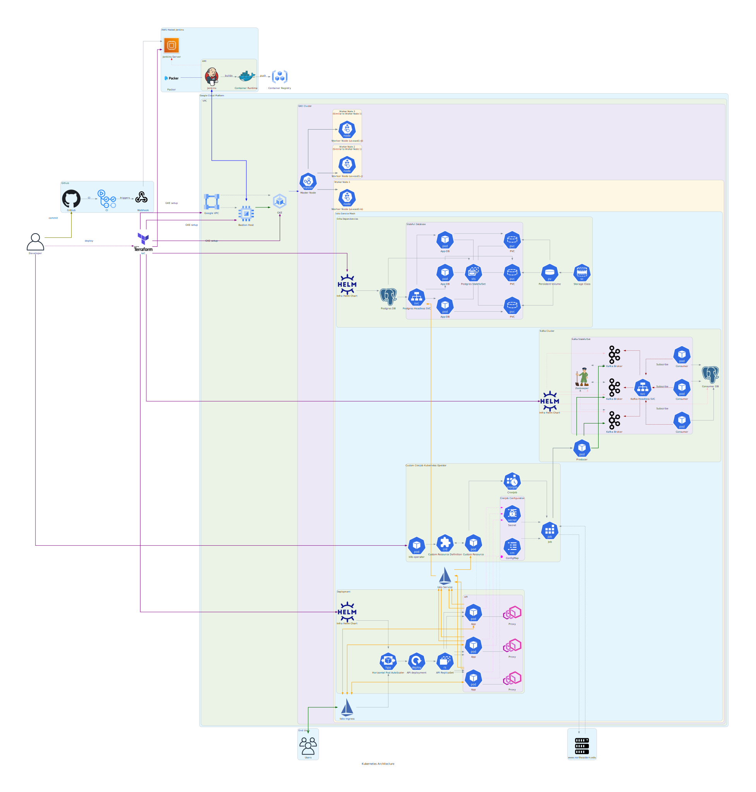

# Architecture

To create version controlled infrastructure architecture diagrams, and have proper audit trails, we make use of a new concept called `Diagram as Code` or `DaC`.

This is still a work in progress, for implementation details, visit [Diagrams](https://diagrams.mingrammer.com/), which lets us create diagrams programmatically using Python.

## Setup

The only pre-requisite is you need to have python installed on your workstation.
To setup the python environment for development, we need to install a few tools. Let's set them up:

- Install [Poetry](https://python-poetry.org/):

  ```shell
  # This is only for MacOS users, for other distros, refer the documentation
  brew install poetry
  ```

- Run `init` to initialize the project, similar to `npm init` as in the case of `npm`:

  ```shell
  # This command will guide you through creating your `pyproject.toml` config.
  poetry init
  ```

- Add the [Diagrams](https://diagrams.mingrammer.com/docs/getting-started/installation) library to the poetry `pyproject.toml` file:

  ```shell
  # This command will create a virtualenv at $HOME/Library/Caches/pypoetry/virtualenvs/
  poetry add diagrams
  ```

- To view the python environment path and executable location for your python project's virtualenv, use the `env info` command:

  ```shell
  poetry env info
  ```

- To run the python file with the DaC definition, we need to set the python interpreter path in `VSCode`. Use `cmd` + `shift` + `p` to open up the command palette, and then type: `Python: Select Interpreter` -> click on `Enter interpreter path...` and then copy and paste the virtualenv executable path here by running the command in the previous step, i.e, `poetry env info`. This will help setup the default interpreter to use the exact virtualenv for your specified project.

## Architecture Diagram



## LICENSE

This project is open-sourced under the MIT License. Please read the [LICENSE](./LICENSE) for further details.

## Authors

[Siddharth Rawat](https://github.com/sydrawat01)

[Rishab Agarwal](https://github.com/rishabNeu)

[Karan Wadhwa](https://github.com/karanwadhwa)
